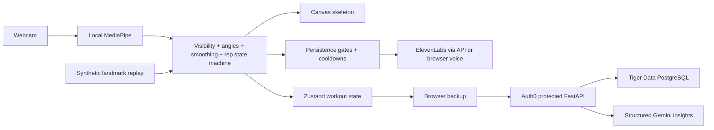

# Architecture

The real-time loop never waits on an API call or audio playback. Inference is capped at approximately 20 Hz; React updates are throttled to 10 Hz except completed-rep events. Canvas drawing happens inside the animation loop. Metrics are sampled at most once per second and bounded per session.

MediaPipe's synchronous browser inference uses a GPU delegate with CPU fallback. This MVP uses the main thread and throttles inference; a worker is a future optimization for devices where inference noticeably reduces responsiveness. It never queues stale video frames. All video remains in the browser.

The analyzer chooses a visible body side, corrects angles for image aspect ratio, and applies time-dependent exponential filtering. A straight-joint hold arms the state machine. Separate movement/return thresholds and reversal hysteresis define complete cycles. Minimum duration and range reject jitter. A shallow but complete cycle receives a range cue. Tracking loss, a side change, a long frame gap, or pause resets the partial cycle and requires recalibration. Faults accumulate across each rep; coaching prioritizes one cue with persistence and cooldown gates. Threshold overrides are accepted by `MovementAnalyzer`.

The API derives ownership from validated RS256 tokens, never request-supplied user identifiers. Each session query checks owner and ID. JWT issuer, audience, signature, expiry, subject, and issued-at claims are checked. Guest mode never sends authenticated API requests.

Client-generated UUIDs make retried session creation safe. Rep numbers are unique within a session; metric keys include session, timestamp, and metric name. Conflicting retries fail instead of overwriting existing events. Finalization derives counts from persisted events and rejects gaps. Backend batches are transactional and PostgreSQL session mutations acquire a row lock.

On Tiger Cloud, `movement_metrics` is a Timescale hypertable. The `movement_metrics_1m` real-time continuous aggregate incrementally stores average, minimum, maximum, and sample counts by session and metric while including the newest raw bucket at query time. A five-minute refresh policy covers the previous 30 days. Raw chunks older than seven days move to Hypercore columnstore, segmented by session and metric and ordered by timestamp. The authenticated summary endpoint reads the continuous aggregate; SQLite computes the same contract as a development fallback.

Each completed session gets a browser backup before upload. Local storage is scoped to the guest or signed-in subject, retains 50 sessions, and supports JSON export. Manual set boundaries and rest presets are frontend-only metadata on that browser copy; the cloud API continues to persist the underlying workout as one session with measured reps and metrics. Local storage is standard same-origin storage, not encrypted. Guest sessions are not silently imported into an account.

ElevenLabs receives only fixed coaching phrases or tightly validated count, rest, transition, and measured-summary grammar. Generated audio is cached in process and in the live coach; concurrent misses for the same phrase are coalesced. A 12/min provider-miss budget is separate from a 60/min endpoint abuse limit, so cached playback does not consume provider capacity. The client warms at most eight selected-exercise phrases, serializes playback through one priority queue, and falls back to browser speech after any provider failure. Gemini receives computed statistics from persisted reps, with instructions against invented metrics and medical claims. Pydantic validates its structure. Provider failures leave the workout and deterministic report intact.

Curls require visible shoulder, elbow, and wrist landmarks; hip visibility enables the optional upper-arm cue. Returning to 150 degrees completes a sufficiently deep, timed curl cycle. Camera positions are smoothed, large transient jumps rejected, and confident bilateral label swaps corrected by spatial continuity. Rendering runs independently at animation-frame cadence; missing joints fade over at most 240 ms, and these held positions never enter rep analysis. A short side-selection hold prevents switching arms immediately on confidence loss. The full visible skeleton and a pose-derived person bounding box are rendered. Curls calibrate and count each arm independently: alternating curls add one arm rep, simultaneous curls add two. Per-arm rep metadata and elbow angles persist in the API. Brief arm dropouts up to 200 ms pause analysis without counting stale positions; longer loss resets that arm. The Full pose model supplies world landmarks for 3D curl angles, with screen-space geometry retained for synthetic fixtures.

The muscle overlay maps the tracked joint angle to a yellow-to-red gradient on the tracked upper arm or thigh. A front/back human muscle diagram highlights the selected exercise's primary and supporting muscles. These visuals represent joint bend, not physiological muscle activation or a form score.

## Implementation references

- [MediaPipe Pose Landmarker for web](https://ai.google.dev/edge/mediapipe/solutions/vision/pose_landmarker/web_js)
- [Gemini structured output](https://ai.google.dev/gemini-api/docs/structured-output)
- [ElevenLabs speech endpoint](https://elevenlabs.io/docs/api-reference/text-to-speech/convert)
