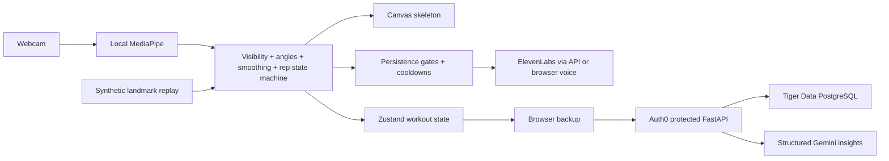

# Architecture

The real-time loop never waits on an API call or audio playback. Inference is capped at approximately 20 Hz; React updates are throttled to 10 Hz except completed-rep events. Canvas drawing happens inside the animation loop. Metrics are sampled at most once per second and bounded per session.

MediaPipe's synchronous browser inference uses a GPU delegate with CPU fallback. This MVP uses the main thread and throttles inference; a worker is a future optimization for devices where inference noticeably reduces responsiveness. It never queues stale video frames. All video remains in the browser.

The analyzer chooses a visible body side, corrects angles for image aspect ratio, and applies time-dependent exponential filtering. A straight-joint hold arms the state machine. Separate movement/return thresholds and reversal hysteresis define complete cycles. Minimum duration and range reject jitter. A shallow but complete cycle receives a range cue. Tracking loss, a side change, a long frame gap, or pause resets the partial cycle and requires recalibration. Faults accumulate across each rep; coaching prioritizes one cue with persistence and cooldown gates. Threshold overrides are accepted by `MovementAnalyzer`.

The API derives ownership from validated RS256 tokens, never request-supplied user identifiers. Each session query checks owner and ID. JWT issuer, audience, signature, expiry, subject, and issued-at claims are checked. Guest mode never sends authenticated API requests.

Client-generated UUIDs make retried session creation safe. Rep numbers are unique within a session; metric keys include session, timestamp, and metric name. Conflicting retries fail instead of overwriting existing events. Finalization derives counts from persisted events and rejects gaps. Backend batches are transactional and PostgreSQL session mutations acquire a row lock.

Each completed session gets a browser backup before upload. Local storage is scoped to the guest or signed-in subject, retains 50 sessions, and supports JSON export. It is standard same-origin storage, not encrypted. Guest sessions are not silently imported into an account.

ElevenLabs receives five approved phrases; generated audio is cached in process and in the live coach. Gemini receives computed statistics from persisted reps, with instructions against invented metrics and medical claims. Pydantic validates its structure. Provider failures leave the workout and deterministic report intact.

## Implementation references

- [MediaPipe Pose Landmarker for web](https://ai.google.dev/edge/mediapipe/solutions/vision/pose_landmarker/web_js)
- [Gemini structured output](https://ai.google.dev/gemini-api/docs/structured-output)
- [ElevenLabs speech endpoint](https://elevenlabs.io/docs/api-reference/text-to-speech/convert)
